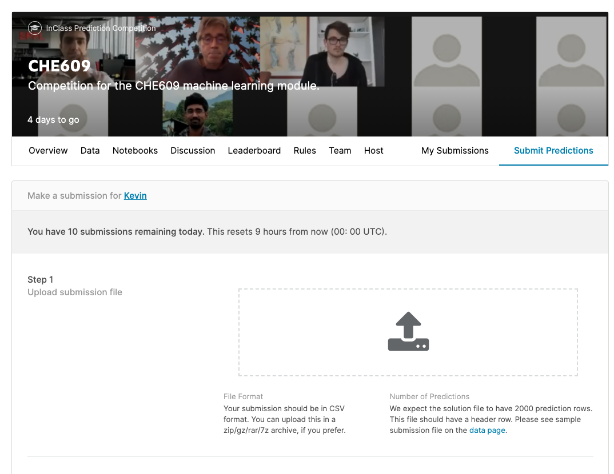

# ML workshop CHE609 at EPFL

[](https://colab.research.google.com/github/kjappelbaum/ml_molsim2020/blob/che609/molsim_ml.ipynb)
[](https://mybinder.org/v2/gh/kjappelbaum/ml_molsim2020.git/master?filepath=molsim_ml)
[](https://www.python.org/download/releases/3.7.0/)
[](https://opensource.org/licenses/MIT)
[](https://github.com/kjappelbaum/ml_molsim2020/actions)
[](https://doi.org/10.5281/zenodo.3605363)

In this exercise we will build a simple model that can predict the carbon dioxide uptake in MOFs.


You can find more background information in the accompanying [notes](notes/notes.pdf).

If you find some errors, typos or issues feel free to [open an issue](https://help.github.com/en/github/managing-your-work-on-github/about-issues) or directly make a [pull request](https://help.github.com/en/github/collaborating-with-issues-and-pull-requests/about-pull-requests).

# How to run it

If you have a modern laptop, we recommend you run them
on the laptop. If you do not want to use your machine or the cluster, you
can also run the exercises on Google Colab or Binder.

### Run it locally (recommended)

Create a new folder and clone this repository (you need `git` for this, if you get a `missing command` error for `git` you can install it with `sudo apt-get install git`)

```(bash)
git clone --depth 1 https://github.com/kjappelbaum/ml_molsim2020.git
cd ml_molsim2020
```

Now you can activate the course environment

```(bash)
conda activate che609
```

And install the additional requirements using

```(bash)
conda env update -f environment.yml
```

After this completed, open the jupyter notebook

```(bash)
jupyter notebook molsim_ml.ipynb
```

### Use it on Google Colab


Here, you can use relatively powerful computing resources from Google for free
(like GPUs and TPUs).
Click the "Open in Colab" button on the top and run the first three cells to
install the dependencies.
Then you should be able to use the notebook in Colab.


**Make sure to make a copy into your Google Drive and work on this copy. And
not on the shared notebook!**

_Note:_ If you have a Google Account from your organization, e.g. university, you might
need to log out and use your personal account as many organizations block
third-party applications.

_Note:_ Google Colab also requires that you reload the JavaScript of holoviews in each plotting cell. 
So, you have to start every cell with a holoviews plot with `hv.extension('bokeh')`

## Join the competition on Kaggle

We also host a [Kaggle competition](http://www.kaggle.com/c/che609) for this exercise.

To join this competition, you need to create an account on www.kaggle.com and use the features (`features.csv`) you can find on the competition site or also in the `data` directory to predict the high-pressure uptake of carbon dioxide.

You can either drag and drop your solution `.csv` on the [submission
page](https://www.kaggle.com/c/che609/submit).



An example submission file can be found in `data/submission.csv`.

Please share your code with a Kaggle notebook!

## Acknowledgements

We want to thank [Leopold Talirz](https://github.com/ltalirz) for incredibly valuable feedback and input, Peter Alexander Knudsen for spotting typos.
